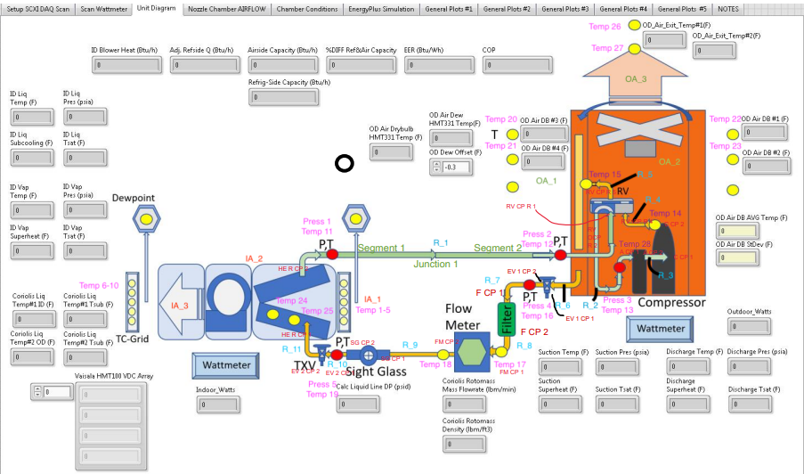

---
jupytext:
  formats: md:myst
  text_representation:
    extension: .md
    format_name: myst
kernelspec:
  display_name: open223-models
  language: python
  name: open223-models
---

#  Heat Pump Laboratory (HPL)

The HPL is a lab at NIST that consists of a bi-directional indoor and outdoor air system.

### Schematic view

## Downloads

- <a href="/compiled/NIST-HPL.ttl">Turtle file (compiled)</a>
- <a href="/withimports/NIST-HPL.ttl">Turtle file (with all imports)</a>
- <a href="/NIST-HPL.ttl">Turtle file (original)</a>
- <a href="/NIST-HPL.jsonld">JSON-LD file (original)</a>

What are these files?

- **Turtle file (original)**: This is the original source Turtle file that was provided to `models.open223.info`, usually as the output of some model creation tool.
- **Turtle file (compiled)**: This is the original Turtle file with all inferred relationships and values added through SHACL inference against the 223P ontology and other dependencies. **You should use this file for any further processing.** It does not contain any of the ontologies.
- **Turtle file (with all imports)**: This is the compiled Turtle file with all imports included in the file (223P ontology, QUDT ontology, and others). This is helpful when you do not want to deal with downloading and managing ontology dependencies. It is also much larger than the compiled file.
- **JSON-LD file (original)**: This is the original Turtle file converted to the JSON-LD format.

[Turtle](https://www.w3.org/TR/turtle/) is a syntax for RDF (Resource Description Framework) that is easy to read and write. It is a popular format for representing linked data. Parsers and serializers
are available in many programming languages. [JSON-LD](https://json-ld.org) is a JSON-based format for linked data that is easy to use with JavaScript and other web technologies.

    
## Queries
| Description | Query URL |
|-------------|-----------|
| Find the downstream equipment for AHU1. | <a href='https://query.open223.info/?query=PREFIX+s223%3A+%3Chttp%3A%2F%2Fdata.ashrae.org%2Fstandard223%23%3E+PREFIX+unit%3A+%3Chttp%3A%2F%2Fqudt.org%2Fvocab%2Funit%2F%3E+PREFIX+rdfs%3A+%3Chttp%3A%2F%2Fwww.w3.org%2F2000%2F01%2Frdf-schema%23%3E+PREFIX+rdf%3A+%3Chttp%3A%2F%2Fwww.w3.org%2F1999%2F02%2F22-rdf-syntax-ns%23%3E+PREFIX+quantitykind%3A+%3Chttp%3A%2F%2Fqudt.org%2Fvocab%2Fquantitykind%2F%3E+PREFIX+qudt%3A+%3Chttp%3A%2F%2Fqudt.org%2Fschema%2Fqudt%2F%3E+PREFIX+sh%3A+%3Chttp%3A%2F%2Fwww.w3.org%2Fns%2Fshacl%23%3E+PREFIX+owl%3A+%3Chttp%3A%2F%2Fwww.w3.org%2F2002%2F07%2Fowl%23%3E+SELECT+%3FconnectionDown+%3FconnectionDown2+WHERE+%7B%0A++++BIND%28IBAL%3AAHU_1+as+%3Fahu%29+%7B%0A%09%7D%0A%09UNION+%7B%0A%09%3Fahu+s223%3AhasConnectionPoint+%3FconnectionPoint+.%0A%09%3FconnectionPoint+a+s223%3AOutletConnectionPoint+.%0A%09%3FconnectionPoint+s223%3AhasMedium+s223%3AMedium-Air+.%0A%09%3FconnectionPoint+s223%3AconnectsThrough+%3Fsegment+.%0A%09%3Fsegment+s223%3AconnectsTo+%3Fjunction+.%0A++++%3Fjunction+s223%3AconnectedTo+%3FconnectionDown+.%0A++++%3FconnectionDown+a+s223%3ATerminalUnit+.%0A%09%7D%0A%09UNION+%7B%0A%09%3Fahu+s223%3AhasConnectionPoint+%3FconnectionPoint+.%0A%09%3FconnectionPoint+a+s223%3AOutletConnectionPoint+.%0A%09%3FconnectionPoint+s223%3AhasMedium+s223%3AMedium-Air+.%0A%09%3FconnectionPoint+s223%3AconnectsThrough+%3Fsegment+.%0A%09%3Fsegment+s223%3AconnectsTo+%3Fjunction+.%0A++++%3Fjunction+s223%3AconnectedTo+%3FconnectionDown+.%0A++++%3FconnectionDown+a+s223%3AJunction+.%0A%09%3FconnectionDown+s223%3AconnectedTo+%3FconnectionDown2+.%0A%09%3FconnectionDown2+a+s223%3ATerminalUnit+.%0A%09%7D%0A%7D%0A&url=https%3A%2F%2Fmodels.open223.info%2Fcompiled%2Fnist-hpl.ttl'>Query Link</a> |

## Model Components
