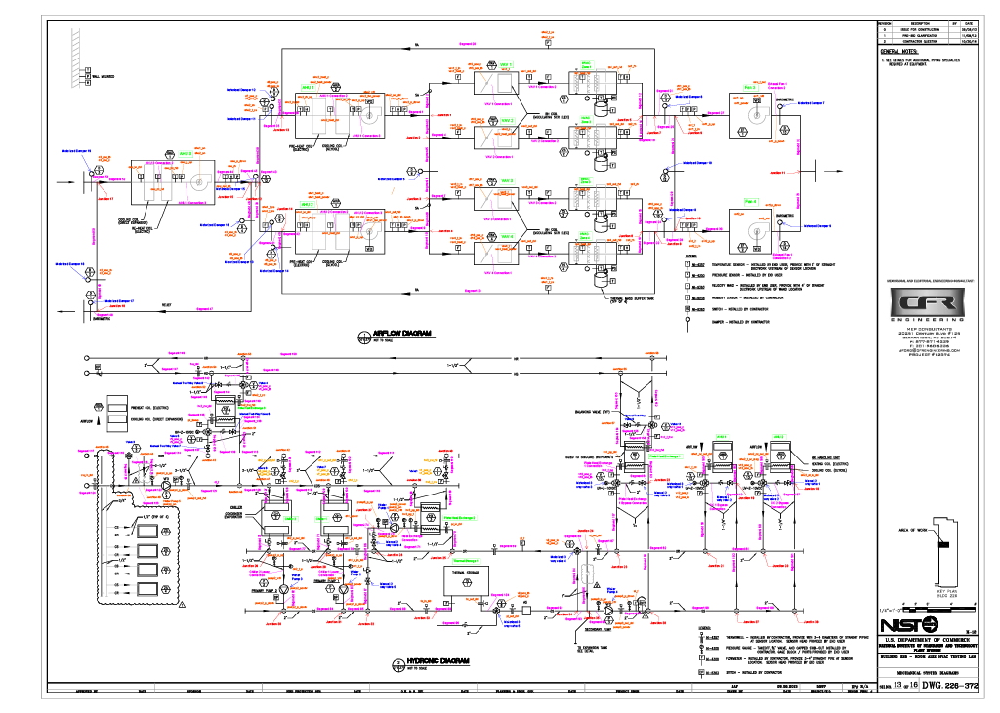

# Intelligent Buildings Agents Laboratory (IBAL)

The IBAL is a mixed system lab at NIST that is able to test commercial equipment under simulated conditions. For more information, vist the [IBAL Database](https://ibal.nist.gov/). 

### Schematic view

## Downloads

## Queries

## Model Components