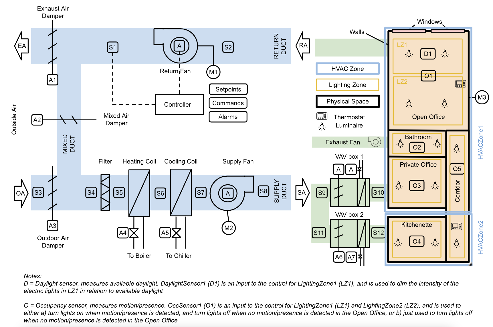

---
jupytext:
  formats: md:myst
  text_representation:
    extension: .md
    format_name: myst
kernelspec:
  display_name: Python 3
  language: python
  name: python3
---
# PNNL Example Building 1 Model 2

Example Building 1 is a simplistic, reference tiny office building consisting of a single story with 5 rooms spanning 5 space types.

This reference building was developed for and first described in the journal article ["Metadata Schemas and Ontologies for Building Energy Applications: A Critical Review and Use Case Analysis"](https://doi.org/10.3390/en14072024).

Example Building 1 Model 2 is provided by Pacific Northwest National Laboratory. 
See [NIST Example Building 1 Model 1](nist-bdg1-1.md) for a different modeling approach for the same building.

### Schematic view



## Contents

This model contains a representation of the building architecture and electrical/lighting system.

In addition to the s223 ontology, the model uses the [Real Estate Core ontology](https://dev.realestatecore.io/ontology/) to describe space types. The Real Estate Core ontology is extended by defining 2 subclasses for rec:Office.
``` ttl
recx:OpenOffice rdfs:subClassOf rec:Office;
  rdfs:label "Open Office".
recx:PrivateOffice rdfs:subClassOf rec:Office;
  rdfs:label "Private Office".
```

## Source

The model was created from source data consisting of a building information model (BIM) created using [Autodesk](https://www.autodesk.com/) Revit, and exported via a [Speckle](https://speckle.systems/) interface.

### Speckle view of rooms and lighting fixtures


Model instance data have a prefix that is resolvable to a Speckle URL.
``` ttl
@prefix bdg1: <http://speckle.xyz/streams/59e5e3c6a8/objects/>
```

For example, the following luminaire resolves to http://speckle.xyz/streams/59e5e3c6a8/objects/e2164e3d14db5fcb6915a4a2c8474579 :
``` ttl
bdg1:e2164e3d14db5fcb6915a4a2c8474579 a s223:Luminaire
```

## Downloads

- <a href="/compiled/pnnl-bdg1-2.ttl">Turtle file (compiled)</a> (<a href="/pnnl-bdg1-2.ttl">original</a>)
- <a href="/pnnl-bdg1-2.jsonld">JSON-LD file (original)</a>
    
## Queries

## Model Components
| Parent Class | Class | Instances |
|------------|-------|----------------|
| [Equipment](https://explore.open223.info/s223/Equipment.html) | [Luminaire](https://explore.open223.info/s223/Luminaire.html) | 12 |
| [Equipment](https://explore.open223.info/s223/Equipment.html) | [OccupantMotionSensor](https://explore.open223.info/s223/OccupantMotionSensor.html) | 6 |
| [Equipment](https://explore.open223.info/s223/Equipment.html) | [ElectricBreaker](https://explore.open223.info/s223/ElectricBreaker.html) | 2 |
| [Connection](https://explore.open223.info/s223/Connection.html) | [ElectricWire](https://explore.open223.info/s223/ElectricWire.html) | 14 |
| [ConnectionPoint](https://explore.open223.info/s223/ConnectionPoint.html) | [OutletConnectionPoint](https://explore.open223.info/s223/OutletConnectionPoint.html) | 26 |
| [ConnectionPoint](https://explore.open223.info/s223/ConnectionPoint.html) | [InletConnectionPoint](https://explore.open223.info/s223/InletConnectionPoint.html) | 26 |
| [DomainSpace](https://explore.open223.info/s223/DomainSpace.html) | [](https://explore.open223.info/s223/.html) | 12 |
| [Zone](https://explore.open223.info/s223/Zone.html) | [](https://explore.open223.info/s223/.html) | 8 |
| [Property](https://explore.open223.info/s223/Property.html) | [QuantifiableProperty](https://explore.open223.info/s223/QuantifiableProperty.html) | 24 |
| [Property](https://explore.open223.info/s223/Property.html) | [EnumeratedObservableProperty](https://explore.open223.info/s223/EnumeratedObservableProperty.html) | 6 |

